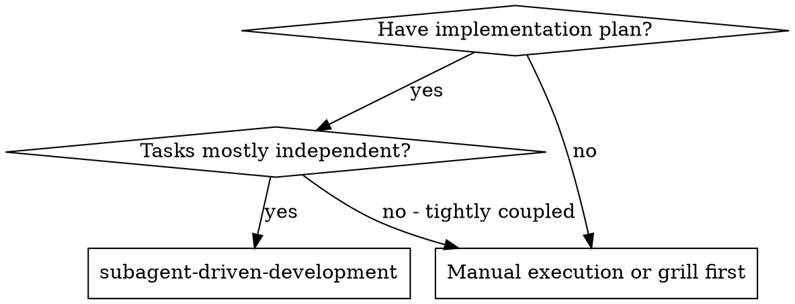
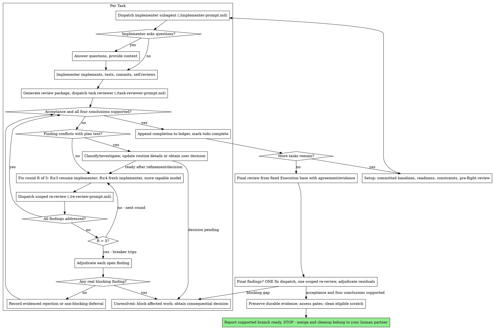

# Workflow illustrations

The numbered sequence in [SKILL.md](SKILL.md) is authoritative. Consult these
illustrations when you need a diagram or a worked example of that sequence.

## When to Use



**Properties:**
- Same session (no context switch)
- Fresh subagent per task (no context pollution)
- Review after each task (implementation correctness, design validity, evidence quality, and scope and standards), broad review at the end
- Continuous execution within agreed decisions

## The Process



## Common Rationalizations

| Excuse | Reality |
|--------|---------|
| "Close enough on spec compliance" | Reviewer found spec gaps = not done. A cap stops retries; acceptance failures remain incomplete. |
| "I'll fix it myself, dispatching is overhead" | Controller fixes pollute your context and skip review. Resume the implementer. |
| "One more round will converge" | Past the cap, rounds don't converge — the failure is structural. Adjudicate and route. |
| "The reviewer will just find something new anyway" | Scoped re-reviews verify fixes; they cannot wander. Route blocking discoveries to the controller; defer only non-blocking items. |
| "This finding is obviously wrong, I'll drop it" | Reject with evidence and preserve the disposition in the plan and ledger. Silent discards are forbidden. |
| "The fix was small, skip the re-review" | Unreviewed fixes are how regressions land. Every round ends with a scoped re-review. |
| "Reviews slow the loop down" | The loop without reviews is just unverified churn. Reviews are the loop's brakes and steering. |
| "Ledger bookkeeping is overhead" | The ledger tracks progress; committed plans and evidence also survive scratch cleanup. Controllers without one have re-dispatched entire completed task sequences. |
| "The implementer spawned its own reviewer — free extra assurance" | It's a duplicate seat reviewing the same diff; the task review is the gate. A worker-spawned reviewer is a defect to flag, not rigor. |

## Example Workflow

```
You: I'm using Subagent-Driven Development to execute this plan.

[Setup: optional worktree choice honored]
[Read plan file once: docs/plans/NNNN-<feature-name>.md]
[Resolve workspace: bash scripts/sdd-workspace docs/plans/NNNN-<feature-name>.md — no ledger inside, fresh start]
[Record committed Agreement baseline and fixed Execution base; create todos]
[Investigate preflight conflicts; consequential choices go to the user]

Task 1: Hook installation script

[Assess semantic Ready status, update task context, require task-brief exit 0]
[Dispatch with brief + report paths + binding constraints + decisions/evidence]

Implementer: "Before I begin - should the hook be installed at user or system level?"

You: "The agreed ADR specifies user level (~/.config/superpowers/hooks/).
If ownership were undecided, affected work would wait for the user decision."

Implementer: [Later]
  - Implemented install-hook command
  - Added tests, 5/5 passing
  - Self-review: Found I missed --force flag, added it
  - Committed

[Run review-package PLAN_FILE BASE HEAD; dispatch task reviewer with the printed path]
Task reviewer: All four conclusions Verified with acceptance evidence; no blockers.

[Ledger: Task 1: complete (commits a1b2c3d..d4e5f6a, review clean)]

Task 2: Recovery modes

[Reassess Task 2 readiness/dependencies; refine permitted details in the plan]
[Require extraction exit 0; dispatch with the same constraints/decision/evidence context]

Implementer: [No questions]
  - Added verify/repair modes
  - 8/8 tests passing
  - Committed

[Run review-package PLAN_FILE BASE HEAD; dispatch task reviewer with the printed path]
Task reviewer: Implementation correctness — Findings:
  - Missing: Progress reporting (spec says "report every 100 items")
  Issues (Important): Magic number (100)

[Fix round 1: resume the implementer with both findings]
Implementer: Added progress reporting, extracted PROGRESS_INTERVAL constant.
  Re-ran test/recovery.test.js — 10/10 passing. Fix report appended.

[Run review-package PLAN_FILE FIX_BASE HEAD; dispatch scoped re-review]
Re-reviewer: Missing progress reporting — ADDRESSED (src/recovery.js:41).
  Magic number — ADDRESSED (src/recovery.js:7). New breakage: none.
  Verdict: affected four conclusions supported; all findings addressed.

[Ledger: Task 2: fix round 1/5 (2 addressed, 0 open; commits d4e5f6a..b7c8d9e)]
[Ledger: Task 2: complete (commits d4e5f6a..b7c8d9e, review clean)]

...

[After all tasks]
[Run review-package PLAN_FILE EXECUTION_BASE HEAD; dispatch a final whole-branch reviewer applying the code-review skill (Standards + Spec), most capable model]
Final reviewers: four conclusions supported by agreement/evidence; no blocking gap.

[If findings remain: one fix dispatch, one scoped re-review; blockers stay incomplete]

[Commit durable plan decisions/evidence before deleting their only scratch source]
[Apply verification-before-completion; assess all accepted outcomes and required gates]
[Only if supported with no blocker: delete eligible scratch]
[Report branch ready and STOP - merge, sanity testing, and worktree cleanup belong to your human partner]
```
