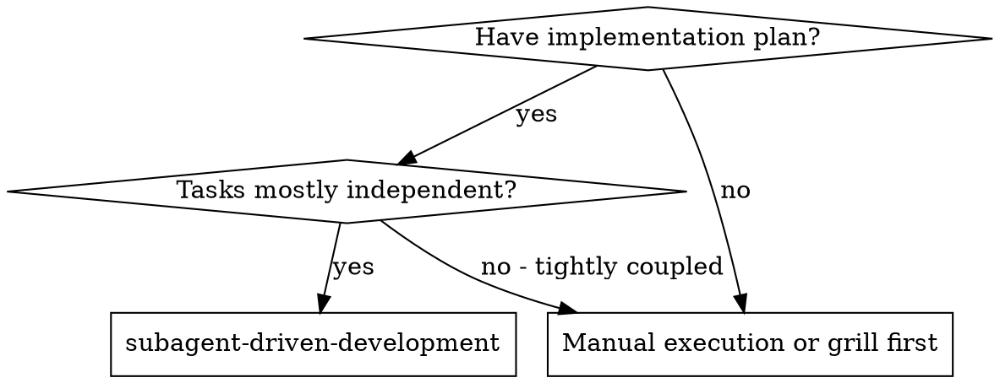
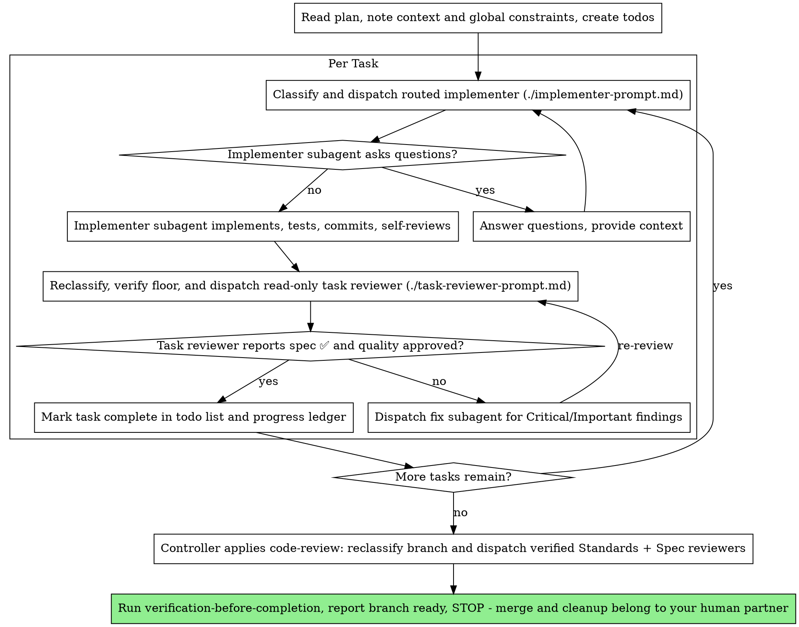

# Subagent-Driven Development

Execute plan by dispatching a fresh implementer subagent per task, a task review (spec compliance + code quality) after each, and a broad whole-branch review at the end.

**Why subagents:** You delegate tasks to specialized agents with isolated context. By precisely crafting their instructions and context, you ensure they stay focused and succeed at their task. They should never inherit your session's context or history — you construct exactly what they need. This also preserves your own context for coordination work.

**Core principle:** Fresh subagent per task + task review (spec + quality) + broad final review = high quality, fast iteration

**Narration:** between tool calls, narrate at most one short line — the
ledger and the tool results carry the record.

**Continuous execution:** Do not pause to check in with your human partner between tasks. Execute all tasks from the plan without stopping. The only reasons to stop are: BLOCKED status you cannot resolve, ambiguity that genuinely prevents progress, inability of the active runtime to verify a required reviewer Effective Floor, an immediate hard-stop Policy Calibration Trigger, or all tasks complete. Pending policy debt from an escaped finding does not stop the current authorized branch's remediation and acceptance work. "Should I continue?" prompts and progress summaries waste their time — they asked you to execute the plan, so execute it.

## When to Use



**Properties:**
- Same session (no context switch)
- Fresh subagent per task (no context pollution)
- Review after each task (spec compliance + code quality), broad review at the end
- Faster iteration (no human-in-loop between tasks)

## The Process



## Pre-Flight Plan Review

Before dispatching Task 1, scan the plan once for conflicts:

- tasks that contradict each other or the plan's Global Constraints
- anything the plan explicitly mandates that the review rubric treats as a
  defect (a test that asserts nothing, verbatim duplication of a logic block)

Present everything you find to your human partner as one batched question —
each finding beside the plan text that mandates it, asking which governs —
before execution begins, not one interrupt per discovery mid-plan. If the
scan is clean, proceed without comment. The review loop remains the net for
conflicts that only emerge from implementation.

## Model Routing

Before the first dispatch, read [model-routing.md](model-routing.md). Apply
Routing Policy Version 2 to every implementer, fixer, task reviewer, and
final-review axis dispatch. The SDD controller owns final-review orchestration;
never delegate the `code-review` workflow to a reviewer subagent.

For each dispatch:

1. Classify the Work Class from the brief, repository evidence, current diff,
   and prior results. Mandatory signals and ambiguity resolve upward.
2. Combine the Work Class floor with the role floor, taking the higher
   capability and reasoning effort independently.
3. Select the first named profile that meets both axes. Every shipped profile
   is Single-Agent; never select Ultra automatically.
4. Establish Floor Verification from explicit named-profile enforcement or a
   trustworthy runtime report. Prompt steering alone is unverified.
5. Write a redacted `started` Dispatch Record, dispatch, then write the matching
   `completed` event.

An implementer or fixer may proceed with an unverified Effective Floor because
its work remains a proposal. A task reviewer or either final-review axis
reviewer requires a verified Effective Floor. If the active runtime cannot
enforce or report that floor, stop before dispatch and name a compatible
surface or configuration. Resume only there with verified capacity; this
active-runtime stop does not itself require Policy Calibration. If no
compatible surface or configuration can obtain the reviewer, emit the
hard-stop `POLICY_CALIBRATION_REQUIRED`, provide the redacted calibration
brief, name `$grill-with-docs` in `engineering-skills`, and wait. Never
silently substitute downward.

Review independence means fresh context, read-only authority, and adversarial
instructions. It does not require a different provider or model family from
the implementer. Recompute classification when new evidence appears; never
lower either axis silently.

## Handling Implementer Status

Implementer subagents report one of four statuses. Handle each appropriately:

**DONE:** Generate the review package (`scripts/review-package BASE HEAD`, from this skill's directory — it prints the unique file path it wrote; BASE is the commit you recorded before dispatching the implementer — never `HEAD~1`, which silently drops all but the last commit of a multi-commit task), then dispatch the task reviewer with the printed path.

**DONE_WITH_CONCERNS:** The implementer completed the work but flagged doubts. Read the concerns before proceeding. If the concerns are about correctness or scope, address them before review. If they're observations (e.g., "this file is getting large"), note them and proceed to review.

**NEEDS_CONTEXT:** The implementer needs information that wasn't provided. Provide the missing context and re-dispatch.

**BLOCKED:** The implementer cannot complete the task. Assess the blocker:
1. Repair missing or noisy context.
2. Raise reasoning effort to the next shipped profile that meets both axes.
3. Raise capability to the next shipped profile that meets both axes.
4. Split the task only when the split preserves correctness.
5. Ask the human when the preceding steps cannot produce a trustworthy result.

**Never** ignore an escalation or force the same model to retry without changes. If the implementer said it's stuck, something needs to change.

## Handling Reviewer ⚠️ Items

The task reviewer may report "⚠️ Cannot verify from diff" items — requirements
that live in unchanged code or span tasks. These do not block the rest of the
review, but you must resolve each one yourself before marking the task
complete: you hold the plan and cross-task context the reviewer
lacks. If you confirm an item is a real gap, treat it as a failed spec
review — send it back to the implementer and re-review.

## Fix and Re-Review Routing

For every Critical or Important finding, compute Fix Work Class as the higher
of the original task's Work Class and the finding's Work Class. Route the fixer
from that result. Re-review at a floor no lower than the reviewer that found
the issue. Never repeat an unchanged failed dispatch.

If a task reviewer or either final-review axis reviewer returns
`FLOOR_UNVERIFIED`, discard the result as a gate, finish any already-running
peer, stop before another reviewer dispatch, and name a compatible surface or
configuration. Resume only there with verified capacity. If none can obtain
the reviewer, emit the hard-stop `POLICY_CALIBRATION_REQUIRED`, provide the
redacted brief, name `$grill-with-docs` in `engineering-skills`, and wait.

If a Critical or Important finding escaped a verified task review, emit
`POLICY_CALIBRATION_REQUIRED` as pending policy debt and provide a redacted brief
with record identifiers. Recompute final review as Exceptional/xhigh, finish
in-flight work, and complete current-branch fixes, re-review, both final axes,
and verification. If all gates pass, report Branch Ready together with the
pending calibration requirement. Begin no future SDD work until the human
resolves it through `$grill-with-docs` in `engineering-skills`.

If work was incorrectly declared Branch Ready, finish already-running
dispatches, preserve their results, emit the hard-stop
`POLICY_CALIBRATION_REQUIRED`, provide the redacted brief and next manual gear,
and start no new dispatch or readiness claim. The human owns global policy
changes; do not patch the policy opportunistically inside this workflow.

## Constructing Reviewer Prompts

Per-task reviews are task-scoped gates. The broad review happens once, at the
final whole-branch review. When you fill a reviewer template:

- Do not add open-ended directives like "check all uses" or "run race tests
  if useful" without a concrete, task-specific reason
- Do not ask a reviewer to re-run tests the implementer already ran on the
  same code — the implementer's report carries the test evidence
- Do not pre-judge findings for the reviewer — never instruct a reviewer to
  ignore or not flag a specific issue. If you believe a finding would be a
  false positive, let the reviewer raise it and adjudicate it in the review
  loop. If the prompt you are writing contains "do not flag," "don't treat X
  as a defect," "at most Minor," or "the plan chose" — stop: you are
  pre-judging, usually to spare yourself a review loop.
- The global-constraints block you hand the reviewer is its attention
  lens. Copy the binding requirements verbatim from the plan's Global
  Constraints section or the spec: exact values, exact formats, and the
  stated relationships between components ("same layout as X", "matches
  Y"). The reviewer's template already carries the process rules (YAGNI,
  test hygiene, review method) — the constraints block is for what THIS
  project's spec demands.
- Hand the reviewer its diff as a file: run this skill's
  `scripts/review-package BASE HEAD` and pass the reviewer the file path
  it prints (or, without bash: `git log --oneline`, `git diff --stat`,
  and `git diff -U10` for the range, redirected to one uniquely named
  file). The output never enters your own context, and the reviewer sees
  the commit list, stat summary, and full diff with context in one Read
  call. Use the BASE you recorded before dispatching the implementer —
  never `HEAD~1`, which silently truncates multi-commit tasks.
- A dispatch prompt describes one task, not the session's history. Do not
  paste accumulated prior-task summaries ("state after Tasks 1-3") into
  later dispatches — a real session's dispatch hit 42k chars of which 99%
  was pasted history. A fresh subagent needs its task, the interfaces it
  touches, and the global constraints. Nothing else.
- Dispatch fix subagents for Critical and Important findings. Record Minor
  findings in the progress ledger as you go, and point the final
  whole-branch review at that list so it can triage which must be fixed
  before merge. A roll-up nobody reads is a silent discard.
- A finding labeled plan-mandated — or any finding that conflicts with
  what the plan's text requires — is the human's decision, like any plan
  contradiction: present the finding and the plan text, ask which governs.
  Do not dismiss the finding because the plan mandates it, and do not
  dispatch a fix that contradicts the plan without asking.
- The SDD controller owns the final whole-branch review. Run
  `scripts/review-package MERGE_BASE HEAD` (MERGE_BASE = the commit the
  branch started from, e.g. `git merge-base main HEAD`) and give the printed
  path to the controller-owned `code-review` workflow for its Standards and
  Spec axis dispatches. Do not delegate `code-review` orchestration to a
  reviewer profile.
- Every fix dispatch carries the implementer contract: the fix subagent
  re-runs the tests covering its change and reports the results. Name the
  covering test files in the dispatch — a one-line fix does not need the
  whole suite. Before re-dispatching the reviewer, confirm the fix report
  contains the covering tests, the command run, and the output; dispatch
  the re-review once all three are present.
- If the final whole-branch review returns findings, dispatch ONE fix
  subagent with the complete findings list — not one fixer per finding.
  Per-finding fixers each rebuild context and re-run suites; a real
  session's final-review fix wave cost more than all its tasks combined.

## File Handoffs

Everything you paste into a dispatch prompt — and everything a subagent
prints back — stays resident in your context for the rest of the session
and is re-read on every later turn. Hand artifacts over as files:

- **Task brief:** before dispatching an implementer, run this skill's
  `scripts/task-brief PLAN_FILE N` — it extracts the task's full text to a
  uniquely named file and prints the path. Compose the dispatch so the
  brief stays the single source of requirements. Your dispatch should
  contain: (1) one line on where this task fits in the project; (2) the
  brief path, introduced as "read this first — it is your requirements,
  with the exact values to use verbatim"; (3) interfaces and decisions
  from earlier tasks that the brief cannot know; (4) your resolution of
  any ambiguity you noticed in the brief; (5) the report-file path and
  report contract. Exact values (numbers, magic strings, signatures, test
  cases) appear only in the brief.
- **Report file:** name the implementer's report file after the brief
  (brief `…/task-N-brief.md` → report `…/task-N-report.md`) and put it in
  the dispatch prompt. The implementer writes the full report there and
  returns only status, commits, a one-line test summary, and concerns.
- **Reviewer inputs:** the task reviewer gets three paths — the same brief
  file, the report file, and the review package — plus the global
  constraints that bind the task.
- Fix dispatches append their fix report (with test results) to the same
  report file and return a short summary; re-reviews read the updated file.

## Durable Progress

Conversation memory does not survive compaction. In real sessions,
controllers that lost their place have re-dispatched entire completed task
sequences — the single most expensive failure observed. Track progress in
a ledger file, not only in todos.

- At skill start, check for a ledger:
  `cat "$(git rev-parse --show-toplevel)/.superpowers/sdd/progress.md"`. Tasks listed there
  as complete are DONE — do not re-dispatch them; resume at the first task
  not marked complete.
- When a task's review comes back clean, append one line to the ledger in
  the same message as your other bookkeeping:
  `Task N: complete (commits <base7>..<head7>, review clean)`.
- The ledger is your recovery map: the commits it names exist in git even
  when your context no longer remembers creating them. After compaction,
  trust the ledger and `git log` over your own recollection.
- `git clean -fdx` will destroy the ledger (it's git-ignored scratch); if
  that happens, recover from `git log`.
- Dispatch records are separate from the progress ledger. Pipe one redacted
  JSON object per event through `scripts/record-dispatch`; it appends to
  `.superpowers/model-routing/dispatches.jsonl` and self-ignores the directory.
- Record `started` before every actual dispatch and `completed` when it returns,
  using the same dispatch ID. Never place prompts, diffs, source code, secrets,
  credentials, or personal data in a Dispatch Record.
- After compaction, reconstruct routing state from the plan, progress ledger,
  git history, and Dispatch Records. Recompute the next dispatch rather than
  trusting an unstated prior classification.

## Prompt Templates

- [implementer-prompt.md](implementer-prompt.md) - Dispatch implementer subagent
- [task-reviewer-prompt.md](task-reviewer-prompt.md) - Dispatch task reviewer subagent (spec compliance + code quality)
- Final whole-branch review: the SDD controller recomputes branch Work Class and invokes the code-review workflow directly. The controller dispatches its fresh read-only Standards and Spec reviewers in parallel at verified Effective Floors. Never ask either Single-Agent reviewer to apply code-review or spawn the other axis.

## Example Workflow

```
You: I'm using Subagent-Driven Development to execute this plan.

[Read plan file once: docs/plans/NNNN-<feature-name>.md]
[Create todos for all tasks]

Task 1: Hook installation script

[Run task-brief for Task 1; dispatch implementer with brief + report paths + context]

Implementer: "Before I begin - should the hook be installed at user or system level?"

You: "User level (~/.config/superpowers/hooks/)"

Implementer: "Got it. Implementing now..."
[Later] Implementer:
  - Implemented install-hook command
  - Added tests, 5/5 passing
  - Self-review: Found I missed --force flag, added it
  - Committed

[Run review-package, dispatch task reviewer with the printed path]
Task reviewer: Spec ✅ - all requirements met, nothing extra.
  Strengths: Good test coverage, clean. Issues: None. Task quality: Approved.

[Mark Task 1 complete]

Task 2: Recovery modes

[Run task-brief for Task 2; dispatch implementer with brief + report paths + context]

Implementer: [No questions, proceeds]
Implementer:
  - Added verify/repair modes
  - 8/8 tests passing
  - Self-review: All good
  - Committed

[Run review-package, dispatch task reviewer with the printed path]
Task reviewer: Spec ❌:
  - Missing: Progress reporting (spec says "report every 100 items")
  - Extra: Added --json flag (not requested)
  Issues (Important): Magic number (100)

[Dispatch fix subagent with all findings]
Fixer: Removed --json flag, added progress reporting, extracted PROGRESS_INTERVAL constant

[Task reviewer reviews again]
Task reviewer: Spec ✅. Task quality: Approved.

[Mark Task 2 complete]

...

[After all tasks]
[SDD controller invokes code-review and dispatches verified Standards + Spec reviewers]
Final reviewer: Standards ✅. Spec ✅. No blocking findings.

[Run verification-before-completion]
[Report branch ready and STOP - merge, sanity testing, and worktree cleanup belong to your human partner]
```

## Advantages

**vs. Manual execution:**
- Subagents follow TDD naturally
- Fresh context per task (no confusion)
- Parallel-safe (subagents don't interfere)
- Subagent can ask questions (before AND during work)

**Properties:**
- Same session (no handoff)
- Continuous progress (no waiting)
- Review checkpoints automatic

**Efficiency gains:**
- Controller curates exactly what context is needed; bulk artifacts move
  as files, not pasted text
- Subagent gets complete information upfront
- Questions surfaced before work begins (not after)

**Quality gates:**
- Self-review catches issues before handoff
- Task review carries two verdicts: spec compliance and code quality
- Review loops ensure fixes actually work
- Spec compliance prevents over/under-building
- Code quality ensures implementation is well-built

**Cost:**
- More subagent invocations (implementer + reviewer per task)
- Controller does more prep work (extracting all tasks upfront)
- Review loops add iterations
- But catches issues early (cheaper than debugging later)

## Red Flags

**Never:**
- Start implementation on main/master branch without explicit user consent
- Skip task review, or accept a report missing either verdict (spec compliance AND task quality are both required)
- Proceed with unfixed issues
- Dispatch multiple implementation subagents in parallel (conflicts)
- Make a subagent read the whole plan file (hand it its task brief —
  `scripts/task-brief` — instead)
- Skip scene-setting context (subagent needs to understand where task fits)
- Ignore subagent questions (answer before letting them proceed)
- Accept "close enough" on spec compliance (reviewer found spec issues = not done)
- Skip review loops (reviewer found issues = implementer fixes = review again)
- Let implementer self-review replace actual review (both are needed)
- Tell a reviewer what not to flag, or pre-rate a finding's severity in the
  dispatch prompt ("treat it as Minor at most") — the plan's example code is
  a starting point, not evidence that its weaknesses were chosen
- Dispatch a task reviewer without a diff file — generate it first
  (`scripts/review-package BASE HEAD`) and name the printed path in the
  prompt
- Move to next task while the review has open Critical/Important issues
- Re-dispatch a task the progress ledger already marks complete — check
  the ledger (and `git log`) after any compaction or resume
- Treat prompt steering as verified model or reasoning enforcement
- Dispatch a task reviewer or either final-review axis reviewer without a verified Effective Floor
- Delegate the code-review workflow to a Single-Agent reviewer profile
- Let an unverified implementer or fixer make work Branch Ready
- Silently substitute a profile below either Effective Floor axis
- Select Ultra automatically or give a Delegating agent write authority
- Begin future SDD work while calibration is pending, or continue after an immediate hard-stop `POLICY_CALIBRATION_REQUIRED`

**If subagent asks questions:**
- Answer clearly and completely
- Provide additional context if needed
- Don't rush them into implementation

**If reviewer finds issues:**
- Implementer (same subagent) fixes them
- Reviewer reviews again
- Repeat until approved
- Don't skip the re-review

**If subagent fails task:**
- Dispatch fix subagent with specific instructions
- Don't try to fix manually (context pollution)

## Integration

**Required workflow skills:**
- **using-git-worktrees** - Optional isolated workspace for heavy work (creates one or verifies existing)
- **writing-plans** - Creates the plan this skill executes
- **code-review** - Two-axis review (Standards + Spec) for the final whole-branch review
- **verification-before-completion** - Final gate before reporting the branch ready
- **receiving-code-review** - Governs how you respond to reviewer subagent feedback

**Subagents should use:**
- **tdd** - Subagents follow seams-based TDD at pre-agreed seams

**After the final review:** run verification-before-completion, then stop and report the branch ready. Merging, sanity testing, and worktree cleanup belong to your human partner - never merge automatically.
