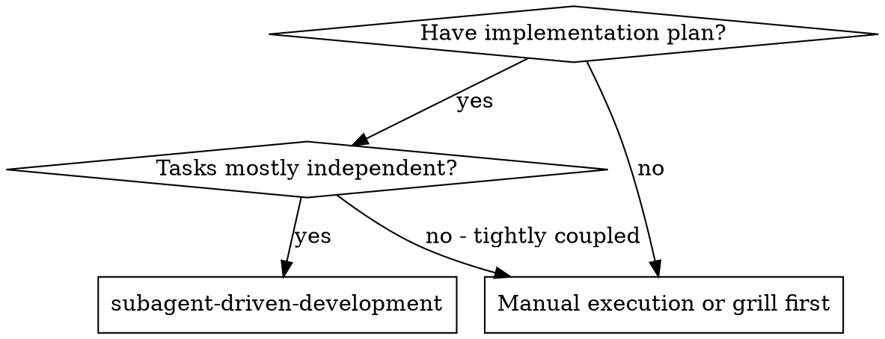
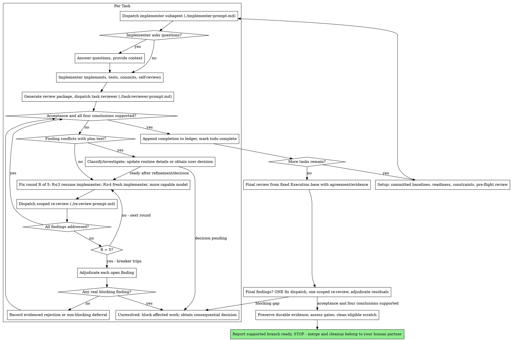

# Subagent-Driven Development

Execute plan by dispatching a fresh implementer subagent per task, a task review (implementation correctness, design validity, evidence quality, and scope and standards) after each, and a broad whole-branch review at the end.

**Why subagents:** You delegate tasks to specialized agents with isolated context. By precisely crafting their instructions and context, you ensure they stay focused and succeed at their task. They should never inherit your session's context or history — you construct exactly what they need. This also preserves your own context for coordination work.

**Core principle:** Fresh subagent per task + task review (implementation correctness, design validity, evidence quality, and scope and standards) + broad final review = high quality, fast iteration

**Narration:** between tool calls, narrate at most one short line — the
ledger and the tool results carry the record.

**Continuous execution:** Continue Ready work within agreed outcomes, ownership,
and scope. Resolve routine facts and reversible details yourself.

**Decisions and feedback:** Apply receiving-code-review to classify findings.
Record routine refinements and evidence in the plan before dispatch. Your
human partner decides changes to behavior, ownership, or scope. Investigate
first, then present the tradeoff and recommendation. Already explicit user
direction is sufficient authorization.

A consequential unknown or decision blocks affected work and its dependants;
unaffected Ready work may continue. Preserve existing approval boundaries for
destructive, irreversible, security-sensitive, or externally publishing actions.
A plan with no evidenced path forward waits for clarification.
A retry cap ends repeated dispatch; it does not satisfy an unmet requirement.

## When to Use


```dot
digraph when_to_use {
    "Have implementation plan?" [shape=diamond];
    "Tasks mostly independent?" [shape=diamond];
    "subagent-driven-development" [shape=box];
    "Manual execution or grill first" [shape=box];

    "Have implementation plan?" -> "Tasks mostly independent?" [label="yes"];
    "Have implementation plan?" -> "Manual execution or grill first" [label="no"];
    "Tasks mostly independent?" -> "subagent-driven-development" [label="yes"];
    "Tasks mostly independent?" -> "Manual execution or grill first" [label="no - tightly coupled"];
}
```

**Properties:**
- Same session (no context switch)
- Fresh subagent per task (no context pollution)
- Review after each task (implementation correctness, design validity, evidence quality, and scope and standards), broad review at the end
- Continuous execution within agreed decisions

## The Process


```dot
digraph process {
    rankdir=TB;

    subgraph cluster_per_task {
        label="Per Task";
        "Dispatch implementer subagent (./implementer-prompt.md)" [shape=box];
        "Implementer asks questions?" [shape=diamond];
        "Answer questions, provide context" [shape=box];
        "Implementer implements, tests, commits, self-reviews" [shape=box];
        "Generate review package, dispatch task reviewer (./task-reviewer-prompt.md)" [shape=box];
        "Acceptance and all four conclusions supported?" [shape=diamond];
        "Finding conflicts with plan text?" [shape=diamond];
        "Classify/investigate; update routine details or obtain user decision" [shape=box];
        "Fix round R of 5: R≤3 resume implementer; R≥4 fresh implementer, more capable model" [shape=box];
        "Dispatch scoped re-review (./re-review-prompt.md)" [shape=box];
        "All findings addressed?" [shape=diamond];
        "R = 5?" [shape=diamond];
        "Adjudicate each open finding" [shape=box];
        "Any real blocking finding?" [shape=diamond];
        "Unresolved: block affected work; obtain consequential decision" [shape=box];
        "Record evidenced rejection or non-blocking deferral" [shape=box];
        "Append completion to ledger, mark todo complete" [shape=box];
    }

    "Setup: committed baselines, readiness, constraints, pre-flight review" [shape=box];
    "More tasks remain?" [shape=diamond];
    "Final review from fixed Execution base with agreement/evidence" [shape=box];
    "Final findings? ONE fix dispatch, one scoped re-review, adjudicate residuals" [shape=box];
    "Preserve durable evidence; assess gates; clean eligible scratch" [shape=box];
    "Report supported branch ready, STOP - merge and cleanup belong to your human partner" [shape=box style=filled fillcolor=lightgreen];

    "Setup: committed baselines, readiness, constraints, pre-flight review" -> "Dispatch implementer subagent (./implementer-prompt.md)";
    "Dispatch implementer subagent (./implementer-prompt.md)" -> "Implementer asks questions?";
    "Implementer asks questions?" -> "Answer questions, provide context" [label="yes"];
    "Answer questions, provide context" -> "Implementer implements, tests, commits, self-reviews";
    "Implementer asks questions?" -> "Implementer implements, tests, commits, self-reviews" [label="no"];
    "Implementer implements, tests, commits, self-reviews" -> "Generate review package, dispatch task reviewer (./task-reviewer-prompt.md)";
    "Generate review package, dispatch task reviewer (./task-reviewer-prompt.md)" -> "Acceptance and all four conclusions supported?";
    "Acceptance and all four conclusions supported?" -> "Append completion to ledger, mark todo complete" [label="yes"];
    "Acceptance and all four conclusions supported?" -> "Finding conflicts with plan text?" [label="no"];
    "Finding conflicts with plan text?" -> "Classify/investigate; update routine details or obtain user decision" [label="yes"];
    "Classify/investigate; update routine details or obtain user decision" -> "Unresolved: block affected work; obtain consequential decision" [label="decision pending"];
    "Classify/investigate; update routine details or obtain user decision" -> "Fix round R of 5: R≤3 resume implementer; R≥4 fresh implementer, more capable model" [label="ready after refinement/decision"];
    "Finding conflicts with plan text?" -> "Fix round R of 5: R≤3 resume implementer; R≥4 fresh implementer, more capable model" [label="no"];
    "Fix round R of 5: R≤3 resume implementer; R≥4 fresh implementer, more capable model" -> "Dispatch scoped re-review (./re-review-prompt.md)";
    "Dispatch scoped re-review (./re-review-prompt.md)" -> "All findings addressed?";
    "All findings addressed?" -> "Acceptance and all four conclusions supported?" [label="yes"];
    "All findings addressed?" -> "R = 5?" [label="no"];
    "R = 5?" -> "Fix round R of 5: R≤3 resume implementer; R≥4 fresh implementer, more capable model" [label="no - next round"];
    "R = 5?" -> "Adjudicate each open finding" [label="yes - breaker trips"];
    "Adjudicate each open finding" -> "Any real blocking finding?";
    "Any real blocking finding?" -> "Unresolved: block affected work; obtain consequential decision" [label="yes"];
    "Any real blocking finding?" -> "Record evidenced rejection or non-blocking deferral" [label="no"];
    "Record evidenced rejection or non-blocking deferral" -> "Acceptance and all four conclusions supported?";
    "Append completion to ledger, mark todo complete" -> "More tasks remain?";
    "More tasks remain?" -> "Setup: committed baselines, readiness, constraints, pre-flight review" [label="yes"];
    "More tasks remain?" -> "Final review from fixed Execution base with agreement/evidence" [label="no"];
    "Final review from fixed Execution base with agreement/evidence" -> "Final findings? ONE fix dispatch, one scoped re-review, adjudicate residuals";
    "Final findings? ONE fix dispatch, one scoped re-review, adjudicate residuals" -> "Unresolved: block affected work; obtain consequential decision" [label="blocking gap"];
    "Final findings? ONE fix dispatch, one scoped re-review, adjudicate residuals" -> "Preserve durable evidence; assess gates; clean eligible scratch" [label="acceptance and four conclusions supported"];
    "Preserve durable evidence; assess gates; clean eligible scratch" -> "Report supported branch ready, STOP - merge and cleanup belong to your human partner";
}
```

## Setup

If the user chose isolation, use `using-git-worktrees` to create a worktree or verify the existing one. Otherwise work on the current branch.
Never start implementation on a main/master branch without your human
partner's explicit consent.

Conversation memory does not survive compaction. In real sessions,
controllers that lost their place have re-dispatched entire completed task
sequences — the single most expensive failure observed. Track progress in
a ledger file, not only in todos.

- Each plan owns a workspace: at skill start, run this skill's
  `bash scripts/sdd-workspace PLAN_FILE` — it prints the plan's git-ignored
  directory (under `<repo-root>/.superpowers/sdd/`), home to
  every artifact for THIS plan: ledger, briefs, reports, review packages.
  Another plan's directory is never yours to read or write.
- Check for this plan's ledger at `<workspace>/progress.md`. If its first
  line names your plan file, tasks with a `Task <N>: complete` line are DONE
  — do not re-dispatch them; resume at the first task without one. A task
  whose last line is a fix round is mid-loop: resume the loop at the next
  round. A ledger whose first line names a different plan file — or a stray
  ledger at the old flat path `.superpowers/sdd/progress.md` — is another
  plan's progress: leave it in place and start your own, fresh.
- Create the ledger with its identity as the first line:
  `# SDD ledger — plan: <plan file path>`.
- The ledger is your recovery map: the commits it names exist in git even
  when your context no longer remembers creating them. After compaction,
  trust the ledger and `git log` over your own recollection.
- `git clean -fdx` will destroy the workspace (it's git-ignored scratch); if
  that happens, recover from `git log`.

Read the plan's outcomes, verification criteria, Global Constraints, and
decision sources: applicable glossary/ADRs and any optional spec. Resolve
conflicts against current agreed decisions. A missing separate spec does not
make the agreement provisional. Escalate conflicting decisions rather than
inventing precedence between contradictory sources.

Before the first production task, ensure the agreed plan and relevant
glossary/ADR changes exist in a committed revision. Reuse an existing revision
representing that content. Otherwise stage only agreed document paths,
inspect the exact staged change, and create a focused documentation commit.
Preserve unrelated staged/working-tree changes; report a concrete obstruction
if a safe path-scoped commit cannot be made.

Record the Agreement baseline revision and paths. Record Execution base once
before the first implementation task and use it for final review; never
recompute it from main/master after inline execution has moved that branch.
Resume with the recorded values.

Keep Ready and Provisional tasks visible. Before dispatch, verify dependencies
and evidence, make permitted refinements, and update the Ready task before
extraction. A behavior, ownership, or scope change requires your human
partner's decision first.

A Ready task carries concrete acceptance conditions, decision references,
relevant assumptions/evidence, exact interfaces, and verification steps.
Supply applicable Global Constraints with the brief. Legacy tasks without
Status require the same readiness assessment and context.

Before dispatching Task 1, scan the plan once for conflicts, writing down
what you checked as you check it:

- tasks that contradict each other or the plan's Global Constraints
- anything the plan explicitly mandates that the review rubric treats as a
  defect (a test that asserts nothing, verbatim duplication of a logic block)

The scan's output is a table, not a verdict. One row for every pair of tasks
that share a file or an interface: the two tasks, what one produces against
what the other consumes, and what you found. One row for every task: whether
its own text agrees with itself — the tests it specifies against the code it
specifies, the files it creates against the files it later touches. "The scan
is clean" without those rows is not a scan you ran.

Write the table to the ledger and record Provisional interfaces as unresolved
dependencies. Investigate each finding; update routine inconsistencies in the
plan, and obtain the user decision for consequential conflicts before affected
work proceeds. Dispatch only semantically Ready tasks. The review loop remains
the net for conflicts that only emerge from implementation.

## Model Selection

Use the least powerful model that can handle each role to conserve cost and increase speed.

**Mechanical implementation tasks** (isolated functions, clear specs, 1-2 files): use a fast, cheap model. Most implementation tasks are mechanical when the plan is well-specified.

**Integration and judgment tasks** (multi-file coordination, pattern matching, debugging): use a standard model.

**Architecture and design tasks**: use the most capable available model.
The final whole-branch review is one of these — dispatch it on the most
capable available model, not the session default.

**Review tasks**: choose the model with the same judgment, scaled to the
diff's size, complexity, and risk. A small mechanical diff does not need the
most capable model; a subtle concurrency change does. Scoped re-reviews of
small fix diffs take a cheap-to-mid tier.

**Fix-loop escalation (rounds 4-5)**: use a model at least one tier above
the implementer that got stuck.

**Always specify the model explicitly when dispatching a subagent.** An
omitted model inherits your session's model — often the most capable and
most expensive — which silently defeats this section.

**Turn count beats token price.** Wall-clock and context cost scale with how
many turns a subagent takes, and the cheapest models routinely take 2-3× the
turns on multi-step work — costing more overall. Use a mid-tier model as the
floor for reviewers and for implementers working from prose descriptions.
When the task's plan text contains the complete code to write, the
implementation is transcription plus testing: use the cheapest tier for
that implementer. Single-file mechanical fixes also take the cheapest tier.

**Task complexity signals (implementation tasks):**
- Touches 1-2 files with a complete spec → cheap model
- Touches multiple files with integration concerns → standard model
- Requires design judgment or broad codebase understanding → most capable model

## The Task Loop

**Batch small same-shape work.** When the plan lists several tasks that are
each a small, independent edit of the same kind — the same one-line fix,
constant change, or field addition repeated across files — do not dispatch
one subagent per task. Compose ONE dispatch brief listing every file and
its change, send the whole batch to a single subagent, and review its diff
as one unit. Reserve one-dispatch-per-task for work that needs its own
judgment, its own tests, or its own review surface.

Everything you paste into a dispatch prompt — and everything a subagent
prints back — stays resident in your context for the rest of the session
and is re-read on every later turn. Hand artifacts over as files.

**Waiting on dispatched subagents:** never poll a wait interface with
short timeouts, and never sit in one silent, open-ended wait either.
While you have local work — ledger updates, packaging the next review,
reading reports — keep working; child results arrive on their own.
When you are genuinely idle, wait in bounded stretches (five to ten
minutes, where your platform allows), and between stretches post one
line of status and reconcile your live children: list them, and chase
any that finished without reporting. A bounded stretch keeps nearly
all of a long wait's efficiency while guaranteeing a stuck or lost
child is noticed within minutes, not at the end of the session.

### 1. Dispatch the implementer

Record BASE (`git rev-parse HEAD`) before dispatching — the review package
and fix-round diffs need it.

- **Task brief:** before dispatching an implementer, run this skill's
  `bash scripts/task-brief PLAN_FILE N` — it extracts the task's full text to a
  uniquely named file and prints the path. Require exit 0 and semantic readiness;
  never reuse cached output after failed extraction. Compose the dispatch so the
  brief stays the single source of
  requirements. Your dispatch should contain: (1) one line on where this
  task fits in the project; (2) the brief path, introduced as "read this
  first — it is your requirements, with the exact values to use verbatim";
  (3) interfaces and decisions from earlier tasks that the brief cannot
  know; (4) permitted refinements and already agreed decisions;
  (5) the report-file path and report contract. Exact values (numbers,
  magic strings, signatures, test cases) appear only in the brief. Never
  make a subagent read the whole plan file.
- **Report file:** name the implementer's report file after the brief
  (brief `…/task-N-brief.md` → report `…/task-N-report.md`) and put it in
  the dispatch prompt. The implementer writes the full report there and
  returns only status, commits, a one-line test summary, and concerns.
- A dispatch prompt describes one task, not the session's history. Do not
  paste accumulated prior-task summaries ("state after Tasks 1-3") into
  later dispatches — a real session's dispatch hit 42k chars of which 99%
  was pasted history. A fresh subagent needs its task, the interfaces it
  touches, and the global constraints. Nothing else.
- The dispatch carries the no-subagents contract (it is in the
  implementer template): the implementer never dispatches subagents —
  not helpers, and never a reviewer. Review arrives from you, after the
  report. In real sessions, every reviewer a worker spawned duplicated
  the task review the controller dispatched anyway — a full extra
  review seat per task.
- Supply applicable Global Constraints, current task/decision revisions,
  baseline/current source references, and relevant evidence to both implementer
  and reviewer. Carry unresolved/deferred findings that affect the task, using
  durable plan records rather than only scratch pointers.
- Record the implementer's agent identity from the dispatch result —
  fix-loop rounds 1-3 resume this agent.
- Never dispatch multiple implementation subagents in parallel (conflicts).

Template: [implementer-prompt.md](implementer-prompt.md)

### 2. Handle the report

Implementer subagents report one of four statuses. Handle each appropriately:

**DONE:** Generate the review package (`bash scripts/review-package PLAN_FILE BASE HEAD`, from this skill's directory — it prints the unique file path it wrote; BASE is the commit you recorded before dispatching the implementer — never `HEAD~1`, which silently drops all but the last commit of a multi-commit task), then dispatch the task reviewer with the printed path.

**DONE_WITH_CONCERNS:** The implementer completed the work but flagged doubts. Read the concerns before proceeding. If the concerns are about correctness or scope, address them before review. If they're observations (e.g., "this file is getting large"), note them and proceed to review.

**NEEDS_CONTEXT:** The implementer needs information that wasn't provided. Provide the missing context and re-dispatch.

**BLOCKED:** The implementer cannot complete the task. Assess the blocker:
1. If it's a context problem, provide more context and re-dispatch with the same model
2. If the task requires more reasoning, re-dispatch with a more capable model
3. If the task is too large, break it into smaller pieces
4. If the plan itself is wrong, classify and investigate the defect; update routine details or obtain the consequential user decision before redispatch. Record the disposition in the plan and ledger.

**Never** ignore an escalation or force the same model to retry without changes. If the implementer said it's stuck, something needs to change.

If the implementer asks questions — before starting or mid-task — answer
clearly and completely, provide additional context if needed, and don't
rush it into implementation.

### 3. Review the task

Per-task reviews are task-scoped gates. The broad review happens once, at the
final whole-branch review. Never skip the task review, and never accept a
report missing any of the four conclusions: implementation correctness, design
validity, evidence quality, and scope and standards. Each must be supported;
resolve evidence gaps before claiming the affected criterion verified.
Implementer self-review never replaces the task review; both are
needed.

- Hand the reviewer its diff as a file: run this skill's
  `bash scripts/review-package PLAN_FILE BASE HEAD` and pass the reviewer the file path
  it prints (or, without bash: `git log --oneline`, `git diff --stat`,
  and `git diff -U10` for the range, redirected to one uniquely named
  file). The output never enters your own context, and the reviewer sees
  the commit list, stat summary, and full diff with context in one Read
  call. Use the BASE you recorded before dispatching the implementer —
  never `HEAD~1`, which silently truncates multi-commit tasks. Never
  dispatch a task reviewer without a diff file.
- **Reviewer inputs:** the task reviewer gets three paths — the same brief
  file, the report file, and the review package — plus the global
  constraints that bind the task, applicable agreement/baseline and current
  source references, decision revisions, evidence, and deferred findings.
- The global-constraints block you hand the reviewer is its attention
  lens. Copy the binding requirements verbatim from the plan's Global
  Constraints section or the spec: exact values, exact formats, and the
  stated relationships between components ("same layout as X", "matches
  Y"). The reviewer's template already carries the process rules (YAGNI,
  test hygiene, review method) — the constraints block is for what THIS
  project's spec demands.
- Do not add open-ended directives like "check all uses" or "run race tests
  if useful" without a concrete, task-specific reason
- Do not ask a reviewer to re-run tests the implementer already ran on the
  same code — the implementer's report carries the test evidence
- Do not pre-judge findings for the reviewer — never instruct a reviewer to
  ignore or not flag a specific issue. If you believe a finding would be a
  false positive, let the reviewer raise it and adjudicate it in the review
  loop. If the prompt you are writing contains "do not flag," "don't treat X
  as a defect," "at most Minor," or "the plan chose" — stop: you are
  pre-judging, usually to spare yourself a review loop.
The task reviewer may report "⚠️ Cannot verify from diff" items — requirements
that live in unchanged code or span tasks. These do not block the rest of the
review, but you must resolve each one yourself before marking the task
complete: you hold the plan and cross-task context the reviewer
lacks. If you confirm an item is a real gap, treat it as a failed spec
review — it enters the fix loop with the other findings.

Template: [task-reviewer-prompt.md](task-reviewer-prompt.md)

### 4. The fix loop

The loop triggers when the review reports spec ❌, any Critical or Important
finding, or a ⚠️ item you confirmed as a real gap.

Before the loop starts, two routes leave it immediately:

- Record Minor findings in the progress ledger as you go
  (`Task <N>: minor (deferred): <one-liner>`), and point the final
  whole-branch review at that list so it can triage which must be fixed
  before merge. Defer only findings that do not invalidate accepted outcomes. A roll-up nobody reads is a silent discard. Minor findings
  never enter the loop.
- A finding labeled plan-mandated, or conflicting with the plan, requires
  receiving-code-review classification and investigation. A recorded ruling
  cannot override agreed outcomes or ADRs. Update routine details and evidence
  in the plan; obtain the user decision for behavior, ownership, or scope
  changes before affected work resumes.

Everything else enters the loop. A fix round is one fix dispatch plus one
scoped re-review. Five rounds maximum per task:

**Rounds 1-3 — resume the original implementer.** Send it the open findings
verbatim. Its context is intact: it knows the task, the code, and its own
choices. If your harness cannot send another message to a live subagent,
dispatch a fresh implementer carrying the brief path, the report-file path,
and the findings — the report file is the persistent memory either way.

**Rounds 4-5 — dispatch a fresh implementer on a more capable model** (per
Model Selection), with the brief path, the report-file path, the open
findings, and this framing: "A prior implementer attempted this task
[N] times; you own it now. Read the report file for what was tried." A loop
that survives three resumes usually means the implementer cannot see its
own problem — fresh eyes and a capability bump in one move.

**Every round, either way:** apply verification-before-completion evidence
validity. The implementer runs affected checks and required gates, reuses
applicable results, and appends covering Evidence Records (tested state,
commands, exit status, conditions, inspectable output, criteria, and limits)
to the report. Confirm this evidence before dispatching scoped re-review.
Name affected checks in the fix message; broaden only for concrete risk.

**The re-review is scoped.** Run `bash scripts/review-package PLAN_FILE FIX_BASE HEAD`
where FIX_BASE is the head the previous review saw, and dispatch
[re-review-prompt.md](re-review-prompt.md) with the findings list, the
brief, the report file, and the printed diff path. The re-reviewer verdicts
each finding ADDRESSED or NOT ADDRESSED and flags new breakage in the fix
diff only, reassessing the affected four conclusions. New Critical/Important
breakage in the fix diff joins the open findings list. Route out-of-scope
blocking or consequential discoveries to the controller for unresolved/decision
handling; they do not indefinitely expand fix review. Defer only non-blocking
observations that do not invalidate accepted outcomes.

**After each round,** append to the ledger:
`Task <N>: fix round <R>/5 (<X> addressed, <Y> open — <finding one-liners>; commits <a7>..<b7>)`

Never fix findings yourself in the controller session — your context stays
clean for coordination, and controller fixes skip review.

**The breaker.** When round 5's re-review still leaves findings open, stop
dispatching. Adjudicate each open finding yourself — you hold the plan and
the cross-task context the reviewer lacks:

- **Unsupported finding:** reject with inspectable evidence and record both sides.
- **Real non-blocking finding:** defer only if accepted outcomes remain valid;
  record the reason, evidence, and limits for final review.
- **Real blocking finding:** preserve it as unresolved. Affected work and its
  dependants cannot proceed or be marked complete. Investigate plan defects and
  obtain consequential user decisions; unrelated Ready work may continue.

The five-round cap ends repeated dispatch, never an acceptance requirement.
Record each disposition in the plan and ledger; silent discards are forbidden.

### 5. Complete the task

Complete requires supported acceptance and all four review conclusions, with
no real blocking finding. Record deferred non-blocking items and limits in the
plan, then append `Task <N>: complete (commits <base7>..<head7>, four conclusions
supported, <K> non-blocking deferred)` to the ledger and mark the todo complete.
An unresolved blocking finding leaves the task incomplete and blocks affected
dependants. Assess readiness again before dispatching later tasks.

## Final Review

The final whole-branch review gets a package: run
`bash scripts/review-package PLAN_FILE EXECUTION_BASE HEAD`, using the fixed
Execution base recorded before implementation. Never recompute it from
main/master after inline execution has moved that branch. Dispatch on the
most capable available model (see Model Selection), applying `code-review`
for its Standards and Spec axes. Both final reviewers receive the applicable
agreement, decision/source revisions, acceptance evidence, and unresolved or
deferred findings from the durable plan record. Require four supported
conclusions.

If findings remain, dispatch ONE fix subagent with the complete findings list
— not one fixer per finding. Per-finding fixers each rebuild context and re-run
suites; a real session's final-review fix wave cost more than all its tasks combined.
Then run exactly one scoped re-review of the fix wave
(`bash scripts/review-package PLAN_FILE FIX_BASE HEAD`,
[re-review-prompt.md](re-review-prompt.md)). Apply the breaker dispositions to
residual findings; real blocking findings mean incomplete work. There is no
second fix wave. Report unresolved work and consequential decisions to your
human partner.

## Finish

Before scratch cleanup, maintain this section in the plan:

```markdown
## Execution record
- Agreement baseline: [revision and document paths]
- Execution base: [fixed revision]
- Task refinements: [task, decision/source revision, finding, disposition, reason]
- Acceptance evidence: [criterion, command, exit status, tested state including
  relevant dirty changes, relevant conditions, output/stable reference, limits]
- Review conclusions: [four concerns, evidence, unresolved/deferred findings]
```

Preserve relevant output or sufficient inspectable summaries; links to
soon-deleted scratch are insufficient. Preserve additional logs where the
claim needs them. Commit agreed plan/evidence updates during task/fix
bookkeeping before deleting their only scratch source. Substantive decisions
follow ADR supersession. After scratch loss, recover from committed documents
and durable evidence, using git history and recorded baselines.

Apply verification-before-completion and assess accepted outcomes and required
gates against current applicable evidence before cleanup. Branch Ready requires
supported accepted outcomes and all required gates with no blocking gap.
Only then delete eligible scratch for this plan, leaving sibling workspaces
alone. Report actual completion, deferred limits, and unresolved work, and stop.
Merging, sanity testing, and Git-worktree cleanup belong to your human partner.

## Common Rationalizations

| Excuse | Reality |
|--------|---------|
| "Close enough on spec compliance" | Reviewer found spec gaps = not done. A cap stops retries; acceptance failures remain incomplete. |
| "I'll fix it myself, dispatching is overhead" | Controller fixes pollute your context and skip review. Resume the implementer. |
| "One more round will converge" | Past the cap, rounds don't converge — the failure is structural. Adjudicate and route. |
| "The reviewer will just find something new anyway" | Scoped re-reviews verify fixes; they cannot wander. Route blocking discoveries to the controller; defer only non-blocking items. |
| "This finding is obviously wrong, I'll drop it" | Reject with evidence and preserve the disposition in the plan and ledger. Silent discards are forbidden. |
| "The fix was small, skip the re-review" | Unreviewed fixes are how regressions land. Every round ends with a scoped re-review. |
| "Reviews slow the loop down" | The loop without reviews is just unverified churn. Reviews are the loop's brakes and steering. |
| "Ledger bookkeeping is overhead" | The ledger tracks progress; committed plans and evidence also survive scratch cleanup. Controllers without one have re-dispatched entire completed task sequences. |
| "The implementer spawned its own reviewer — free extra assurance" | It's a duplicate seat reviewing the same diff; the task review is the gate. A worker-spawned reviewer is a defect to flag, not rigor. |

## Example Workflow

```
You: I'm using Subagent-Driven Development to execute this plan.

[Setup: optional worktree choice honored]
[Read plan file once: docs/plans/NNNN-<feature-name>.md]
[Resolve workspace: bash scripts/sdd-workspace docs/plans/NNNN-<feature-name>.md — no ledger inside, fresh start]
[Record committed Agreement baseline and fixed Execution base; create todos]
[Investigate preflight conflicts; consequential choices go to the user]

Task 1: Hook installation script

[Assess semantic Ready status, update task context, require task-brief exit 0]
[Dispatch with brief + report paths + binding constraints + decisions/evidence]

Implementer: "Before I begin - should the hook be installed at user or system level?"

You: "The agreed ADR specifies user level (~/.config/superpowers/hooks/).
If ownership were undecided, affected work would wait for the user decision."

Implementer: [Later]
  - Implemented install-hook command
  - Added tests, 5/5 passing
  - Self-review: Found I missed --force flag, added it
  - Committed

[Run review-package PLAN_FILE BASE HEAD; dispatch task reviewer with the printed path]
Task reviewer: All four conclusions Verified with acceptance evidence; no blockers.

[Ledger: Task 1: complete (commits a1b2c3d..d4e5f6a, review clean)]

Task 2: Recovery modes

[Reassess Task 2 readiness/dependencies; refine permitted details in the plan]
[Require extraction exit 0; dispatch with the same constraints/decision/evidence context]

Implementer: [No questions]
  - Added verify/repair modes
  - 8/8 tests passing
  - Committed

[Run review-package PLAN_FILE BASE HEAD; dispatch task reviewer with the printed path]
Task reviewer: Spec ❌:
  - Missing: Progress reporting (spec says "report every 100 items")
  Issues (Important): Magic number (100)

[Fix round 1: resume the implementer with both findings]
Implementer: Added progress reporting, extracted PROGRESS_INTERVAL constant.
  Re-ran test/recovery.test.js — 10/10 passing. Fix report appended.

[Run review-package PLAN_FILE FIX_BASE HEAD; dispatch scoped re-review]
Re-reviewer: Missing progress reporting — ADDRESSED (src/recovery.js:41).
  Magic number — ADDRESSED (src/recovery.js:7). New breakage: none.
  Verdict: affected four conclusions supported; all findings addressed.

[Ledger: Task 2: fix round 1/5 (2 addressed, 0 open; commits d4e5f6a..b7c8d9e)]
[Ledger: Task 2: complete (commits d4e5f6a..b7c8d9e, review clean)]

...

[After all tasks]
[Run review-package PLAN_FILE EXECUTION_BASE HEAD; dispatch a final whole-branch reviewer applying the code-review skill (Standards + Spec), most capable model]
Final reviewers: four conclusions supported by agreement/evidence; no blocking gap.

[If findings remain: one fix dispatch, one scoped re-review; blockers stay incomplete]

[Commit durable plan decisions/evidence before deleting their only scratch source]
[Apply verification-before-completion; assess all accepted outcomes and required gates]
[Only if supported with no blocker: delete eligible scratch]
[Report branch ready and STOP - merge, sanity testing, and worktree cleanup belong to your human partner]
```
